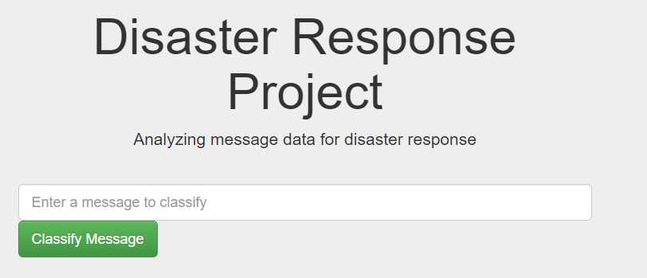
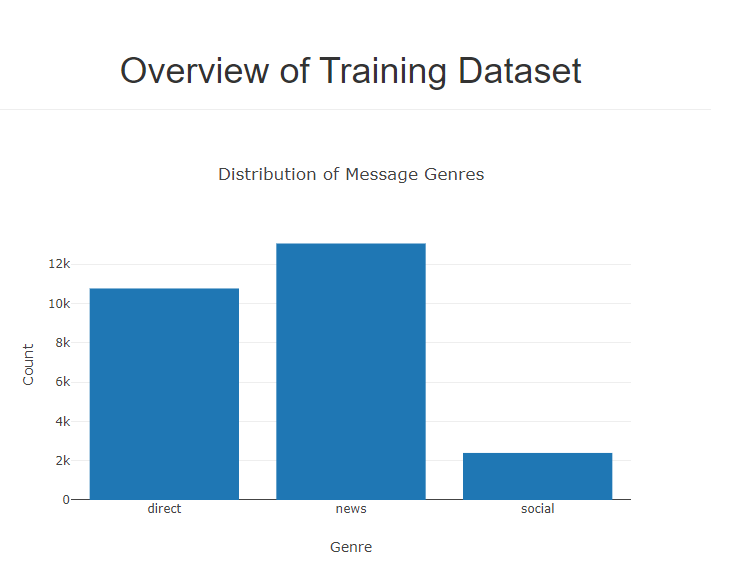

# Disaster Response Pipeline Project

### Summary
Project is a web app where workers of an emergency crew can enter new messages and get a classification as result. The web app also shows graphs to gather some metrics. This project us bas on a machine learning pipeline where it first starts in the ETL stage and goes into the Machine Learning. This application will help people and organization in time of need when disaster hits to help search and see charts for fast response.

### Project Layout
1. ETL Pipeline
2. ML Pipeline
3. Flask Web App

### Installation
To install git clone the repo:
https://github.com/dmoreno757/Disaster-Response-Pipeline

### Instructions:
1. Run the following commands in the project's root directory to set up your database and model.

    - To run ETL pipeline that cleans data and stores in database
        `python data/process_data.py data/disaster_messages.csv data/disaster_categories.csv data/DisasterResponse.db`
    - To run ML pipeline that trains classifier and saves
        `python models/train_classifier.py data/DisasterResponse.db models/classifier.pkl`

2. Run the following command in the app's directory to run your web app.
    `python run.py`

3. Go to http://0.0.0.0:3001/

### Project Structure
app
 - template
   - master.html # main page of web app
   - go.html # classification result page of web app
- run.py # Flask file that runs app
data
- disaster_categories.csv # data to process
- disaster_messages.csv # data to process
- process_data.py
- DisasterResponsee.db # database to save clean data to
models
- train_classifier.py
- classifier.pkl # saved model
README.md

### Acknowledgment
Udacity workspace, statercode, and datasets
